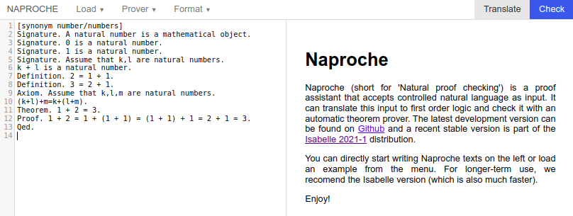

Quick Start: 1 + 2 = 3
================================

Proving theorems (and lemmas, and propositions) is central to (pure)
mathematics. First, assumptions are clearly laid out, after which
consequences are proved by applying logical transformations.
Assumptions are introduced as *definitions*, *axioms* 
or indeed other theorems.
In self-contained presentations also the language 
(or *signature*) of the argument
has to be introduced beforehand. This leads to (nested) text structurings
by

*Signature* / *Definition* / *Axiom* / *Theorem* / *Proof* - Sections.

Let us consider an example text which proves 
\\(1 + 2 = 3\\) from minimal
assumptions on natural numbers:

```lean
[synonym number/numbers]
Signature. A natural number is a mathematical object.
Signature. 0 is a natural number.
Signature. 1 is a natural number.
Signature. Assume that k,l are natural numbers.
k + l is a natural number.
Definition. 2 = 1 + 1.
Definition. 3 = 2 + 1.
Axiom. Assume that k,l,m are natural numbers.
(k+l)+m=k+(l+m).
Theorem. 1 + 2 = 3.
Proof. 1 + 2 = 1 + (1 + 1) = (1 + 1) + 1 = 2 + 1 = 3.
Qed.
```

This text is written in an austere English are
naturally understand as follows:

- The first ``Signature`` section introduces the phrase *natural number* into
the language; the ``[synonym ...]`` command allows to use "natural number"
or its plural "natural numbers" according to English grammar.
- The subsequent ``Signature`` commands introduce the symbols 0, 1, and +.
- The ``Definition`` section introduces the symbols 2 and 3 with defining equalities.
- Of the arithmetic axioms, only the ``Axiom`` of associativity is postulated.
- ``Theorem`` states the conjecture.
- This is proved by a chain of equations enclosed by 
``Proof.`` and ``Qed``.

At the same time the text can be checked for correctness by the programm
Naproche, which is intended to imitate the human reading of the text:

- Copy the text by pressing the copy symbol in the upper corner.
- Direct your browser to the the
<a href="https://naproche.github.io/#/" target="_blank">Naproche web interface</a>.



- Paste the text in the editor buffer of the interface and press the
``Check`` button.
- The output buffer will display information about the parsing
and verification of the text and conclude with some statistics.

One can readily edit the input in the interface and observe the various
reactions of Naproche. Erasing some of the ``Signature`` commands will 
make the parser fail as it will encounter unknown words or symbols (unfortunately
the Naproche error messages are rather cryptic).
The text will check even if the proof of the theorem is omitted since the 
background provers of Naproche are strong enough to find a proof themselves.

### Exercises

1. Define the numbers \\(4\\) and \\(5\\). Prove that \\(2+2=4\\) and similar identities.
2. What happens if you try to prove that \\(2+2=5\\)?
3. Can you prove that \\(1 \neq 2\\)? (In ForThel, ``!=`` stands for \\(\neq\\).)


